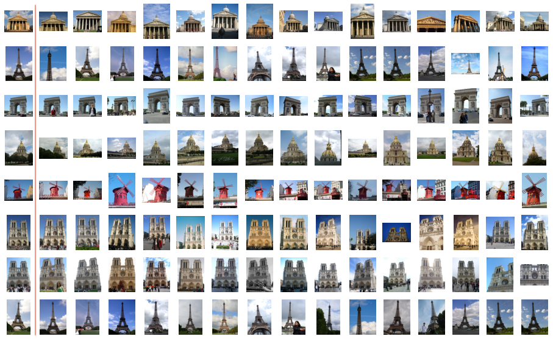

<a href="https://github.com/chenmingxiang110/AugNet">

</a>

# AugNet

> <cite> AugNet: End-to-End Unsupervised Visual Representation Learning with Image Augmentation [arxiv link](https://arxiv.org/abs/2106.06250)</cite>

In our work, we propose AugNet, a new deep learning training paradigm to learn image features from a collection of unlabeled pictures. We develop a method to construct the similarities between pictures as distance metrics in the embedding space by leveraging the inter-correlation between augmented versions of samples. Our experiments demonstrate that the method is able to represent the image in low dimensional space and performs competitively in downstream tasks such as image classification and image similarity comparison. Moreover, unlike many deep-learning-based image retrieval algorithms, our approach does not require access to external annotated datasets to train the feature extractor, but still shows comparable or even better feature representation ability and easy-to-use characteristics.

## Install

```
pip install imgsim==0.1.2
```

## Usage

```
import imgsim
import cv2

vtr = imgsim.Vectorizer()

img0 = cv2.imread("img0.png")
img1 = cv2.imread("img1.png")

vec0 = vtr.vectorize(img0)
vec1 = vtr.vectorize(img1)

# img0's shape equals img1's shape. imgs.shape equals (batch, height, width, 3)
imgs = np.array([img0, img1])
vecs = vtr.vectorize(imgs)

dist = imgsim.distance(vec0, vec1)
print("distance =", dist)
```

## Image Comparision Examples:

Please download the STL10 dataset from:
https://cs.stanford.edu/~acoates/stl10/
and put the files under "./data/stl10_binary".

Please download the pretrained model from:
https://drive.google.com/file/d/1pV3EBZPDDc3z_YKdRJu6ZBF5yn_IHhsK/view?usp=sharing
and put the pth file under "./models"

Run "res34_model_training_with_STL.py" if you would like to train your own model. Run "kmeans_demo.ipynb" to test with K-Means clustering.

The followings are some image comparison examples. The left most images are the queries. The rest images are the topK most similar images that the algorithm found from the dataset based on the distances between the embeddings to the queries'. 

### Paris6k



Reference: https://www.robots.ox.ac.uk/~vgg/data/parisbuildings/

### Anime Illustrations:


Reference: https://www.kaggle.com/mylesoneill/tagged-anime-illustrations

### Pokemons:


Reference: https://veekun.com/dex/downloads

### Humans Sketchs:


Reference: http://cybertron.cg.tu-berlin.de/eitz/projects/classifysketch/

## Welcome to cite our work:

``` 
@misc{chen2021augnet,
    title={AugNet: End-to-End Unsupervised Visual Representation Learning with Image Augmentation},
    author={Mingxiang Chen and Zhanguo Chang and Haonan Lu and Bitao Yang and Zhuang Li and Liufang Guo and Zhecheng Wang},
    year={2021},
    eprint={2106.06250},
    archivePrefix={arXiv},
    primaryClass={cs.CV}
}
```

## TODO:

1. multiple gpu
