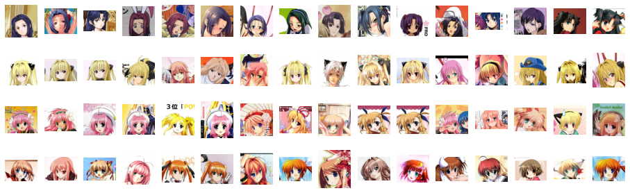
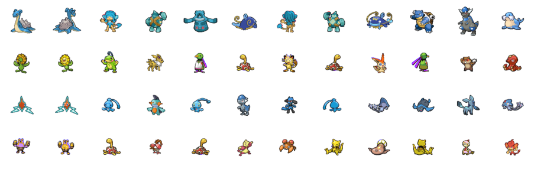
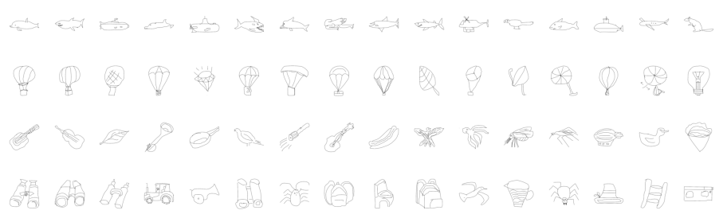

# AugNet

> <cite> AugNet: End-to-End Unsupervised Visual Representation Learning with Image Augmentation [arxiv link](https://arxiv.org/abs/2106.06250)</cite>

In our work, we propose AugNet, a new deep learning training paradigm to learn image features from a collection of unlabeled pictures. We develop a method to construct the similarities between pictures as distance metrics in the embedding space by leveraging the inter-correlation between augmented versions of samples. Our experiments demonstrate that the method is able to represent the image in low dimensional space and performs competitively in downstream tasks such as image classification and image similarity comparison. Moreover, unlike many deep-learning-based image retrieval algorithms, our approach does not require access to external annotated datasets to train the feature extractor, but still shows comparable or even better feature representation ability and easy-to-use characteristics.

## Image Retrieval Examples:

The left most images are the queries. The images are sorted based on the distances of image embeddings.

### Anime Illustrations:



### Pokemon:



### Humans Sketchs:



### Data Source:

The Anime Illustrations Dataset: https://www.kaggle.com/mylesoneill/tagged-anime-illustrations

The Pokemon Dataset: https://veekun.com/dex/downloads

The Humans Sketchs Dataset: http://cybertron.cg.tu-berlin.de/eitz/projects/classifysketch/

## How to use

Please download the STL10 dataset from:
https://cs.stanford.edu/~acoates/stl10/
and put the files under "./data/stl10_binary".

Please download the pretrained model from:
https://drive.google.com/file/d/1pV3EBZPDDc3z_YKdRJu6ZBF5yn_IHhsK/view?usp=sharing
and put the pth file under "./models"

Run "res34_model_training_with_STL.py" to train a model. The pretrained model is trained with STL10 unlabeled data only. Due to file size limitations, we can only provide one pre-trained model. But in general, all test results are obtained using the same training method, so the training data and the model's backbone are the only things needed to be changed (different types of backbones can be viewed in "./lib/utils_torch.py").

Run "test_with_STL_kmeans.py" to test with K-Means clustering.

## Welcome to cite our work (bib):

``` 
@misc{Chen2021augnet,
    title={AugNet: End-to-End Unsupervised Visual Representation Learning with Image Augmentation},
    author={Mingxiang Chen and Zhanguo Chang and Haonan Lu and Bitao Yang and Zhuang Li and Liufang Guo and Zhecheng Wang},
    year={2021},
    eprint={2106.06250},
    archivePrefix={arXiv},
    primaryClass={cs.CV}
}
```
